# 🤖 IA y Minirobots 2026-1

> Repositorio del curso **Inteligencia Artificial y Minirobots 2026-1**  
> Universidad Nacional de Colombia · Autor: **Juan Tinjacá**

---

## 📚 ¿Qué encontrarás aquí?

Una colección de talleres prácticos que recorren los fundamentos y técnicas modernas de la Inteligencia Artificial, desde sus definiciones conceptuales hasta sistemas RAG con LLMs. Cada taller es un Jupyter Notebook autocontenido con teoría, implementación desde cero y visualizaciones.

---

## 🗂️ Talleres

| # | Taller | Tema | Tecnologías |
|---|--------|------|-------------|
| 01 | [Definiciones de IA](taller_01_definiciones_ia/) | Comparación crítica de definiciones de IA (McCarthy, Russell & Norvig, LLMs) | Python · Pandas |
| 02 | [Autómatas Celulares](taller_02_automatas_celulares/) | Modelo SIR de propagación de enfermedades sobre cuadrícula 2D | NumPy · Matplotlib |
| 03 | [Algoritmos Genéticos](taller_03_algoritmos_geneticos/) | Evolución de imágenes RGB para aproximar una imagen objetivo | NumPy · Matplotlib |
| 04 | [Programación Genética](taller_04_programacion_genetica/) | Árboles-programa que controlan un robot repartidor en cuadrícula | NumPy · Matplotlib |
| 05 | [Red Neuronal — Vocales](taller_05_red_neuronal_vocales/) | Red neuronal desde cero para clasificar vocales con ruido | NumPy · Matplotlib |
| 06 | [ML Clásico](taller_06_ml_clasico/) | KNN · SVM · Árbol de decisión · Bayes ingenuo sobre Iris | NumPy · Matplotlib |
| 07 | [Sistema RAG](taller_07_rag/) | Pipeline RAG académico con FAISS, SBERT y LLM (Ollama / OpenAI) | sentence-transformers · FAISS · OpenAI |

---

## 🔬 Detalle de cada taller

### 📖 Taller 01 — Definiciones de IA

Análisis comparativo de seis definiciones de Inteligencia Artificial: dos académicas clásicas (McCarthy 1956, Russell & Norvig 2020) y cuatro generadas por LLMs (ChatGPT, Gemini, Claude, Copilot).

**Criterios de análisis:** enfoque, alcance, precisión y tipo de lenguaje.  
**Resultado:** definición propia argumentada que integra las dimensiones constructiva, comportamental y metodológica.

---

### 🦠 Taller 02 — Autómatas Celulares Probabilísticos

Simulación de la propagación de una enfermedad infecciosa usando un **modelo SIR** sobre una cuadrícula 50×50.

```
Estados:  S (Susceptible) → I (Infectado) → R (Recuperado)
Reglas:   P(S→I) = 1 − (1 − p_inf)^n_vecinos_infectados
          P(I→R) = p_recuperacion por paso
```

**Parámetros:** `p_infeccion = 0.30` · `p_recuperacion = 0.10` · `60 iteraciones`

| Imagen | Descripción |
|--------|-------------|
| 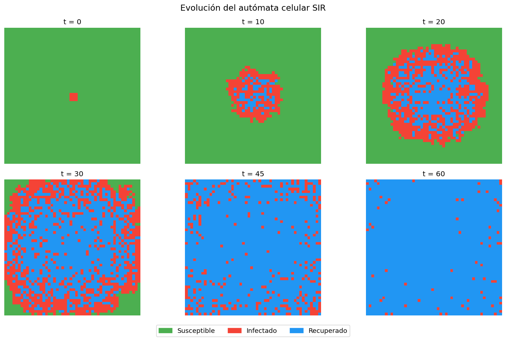 | Evolución temporal del autómata |
| 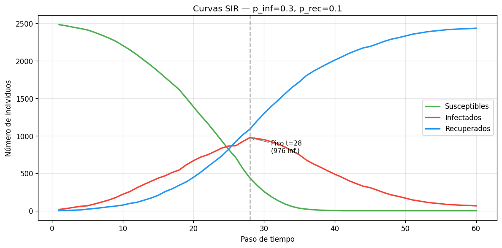 | Curvas SIR a lo largo del tiempo |
| 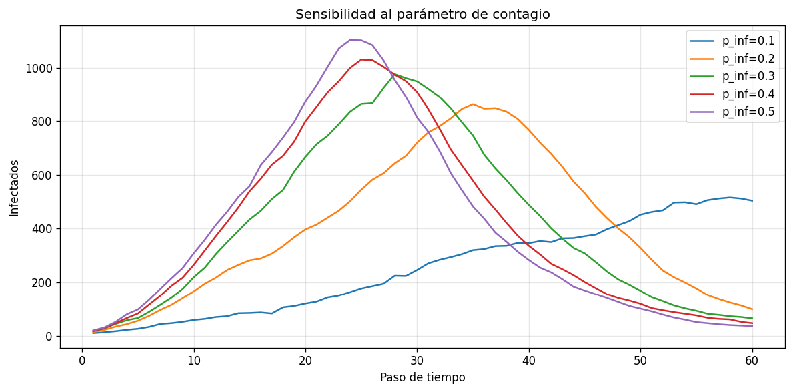 | Análisis de sensibilidad de parámetros |

---

### 🧬 Taller 03 — Algoritmos Genéticos

Evolución de una población de imágenes RGB aleatorias (32×32 px) para aproximarse a una imagen objetivo con degradado sintético.

```
Aptitud:    −MSE (a menor error, mayor aptitud)
Selección:  Torneo binario
Cruce:      Uniforme por píxel (p = 0.5)
Mutación:   Gaussiana N(0, σ=20) con p_mut = 0.05
Elitismo:   2 mejores individuos pasan directamente
```

**Resultado:** MSE inicial ≈ 10 615 → MSE final ≈ 5 430 en 200 generaciones.

| Imagen | Descripción |
|--------|-------------|
| 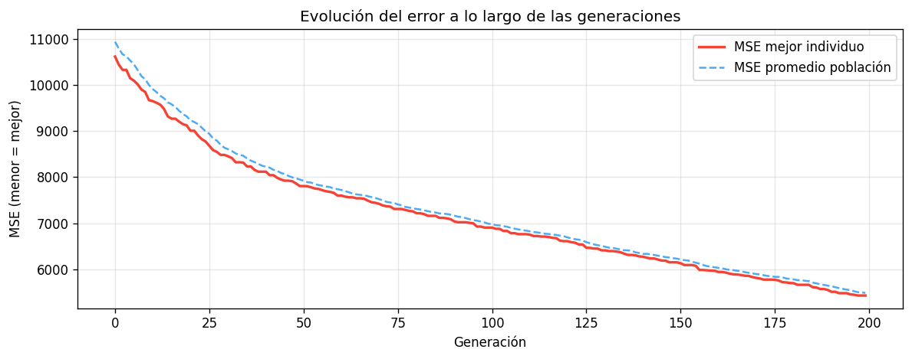 | Curva de aptitud por generación |
| 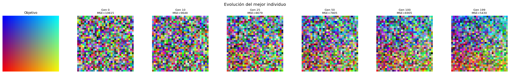 | Evolución visual de la imagen |
| 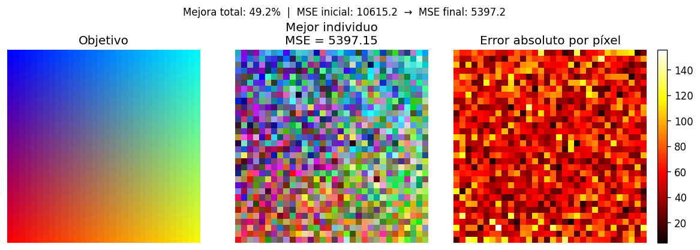 | Comparación objetivo vs. mejor individuo |

---

### 🌳 Taller 04 — Programación Genética

Evolución de **árboles-programa** que controlan un robot repartidor de galletas en una cuadrícula 10×10, maximizando entregas a ingenieros distribuidos.

```
Terminales:  NORTE · SUR · ESTE · OESTE
Funciones:   SEQ(a,b) · IF_INGENIERO(a,b) · REP3(a)
Aptitud:     Número de ingenieros visitados (máx. 8)
Operadores:  Cruce de subárboles · Mutación de subárbol · Torneo (k=3)
```

**Resultado:** mejor solución encontrada = **6 / 8 entregas** en 60 generaciones.

| Imagen | Descripción |
|--------|-------------|
| 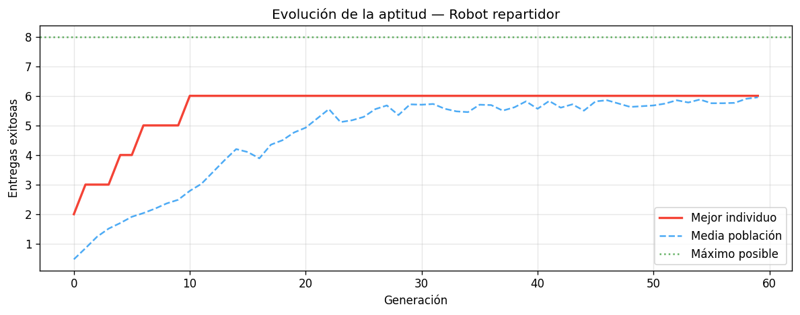 | Curva de aptitud por generación |
| 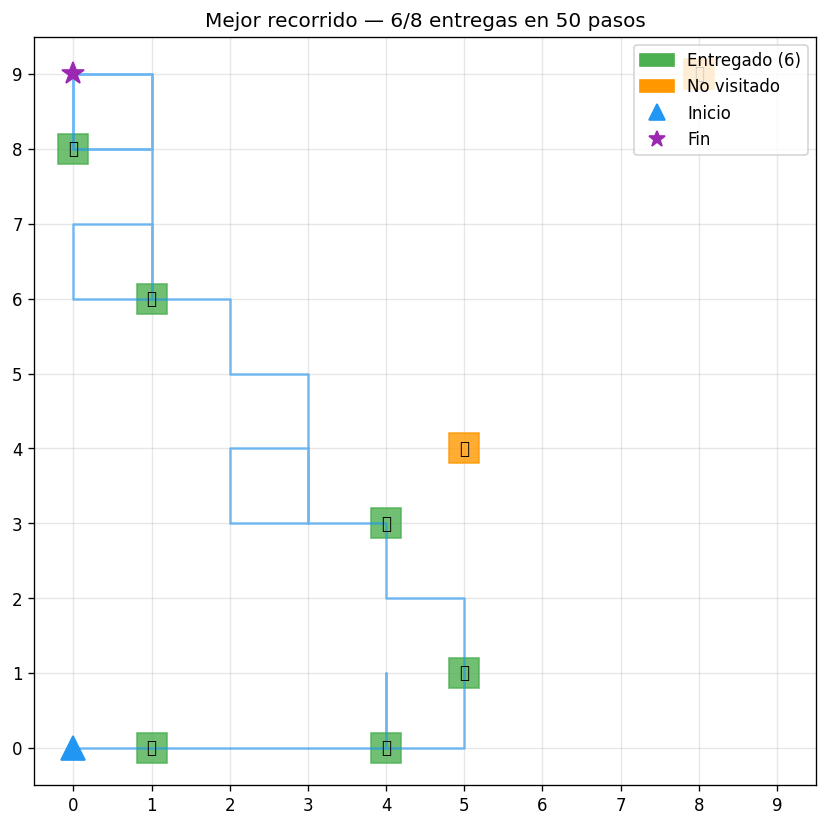 | Ruta del mejor programa en la cuadrícula |

---

### 🔤 Taller 05 — Red Neuronal para Vocales

Red neuronal implementada **desde cero en NumPy** (sin librerías de ML) para clasificar las cinco vocales del español representadas como matrices de píxeles 4×5.

```
Arquitectura:  20 → 8 → 5  (sigmoide · MSE · backprop manual)
Entrenamiento: 5 000 épocas · lr = 0.8
Pérdida final: MSE ≈ 0.000271
```

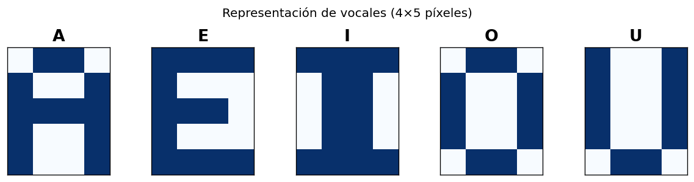

| Imagen | Descripción |
|--------|-------------|
| 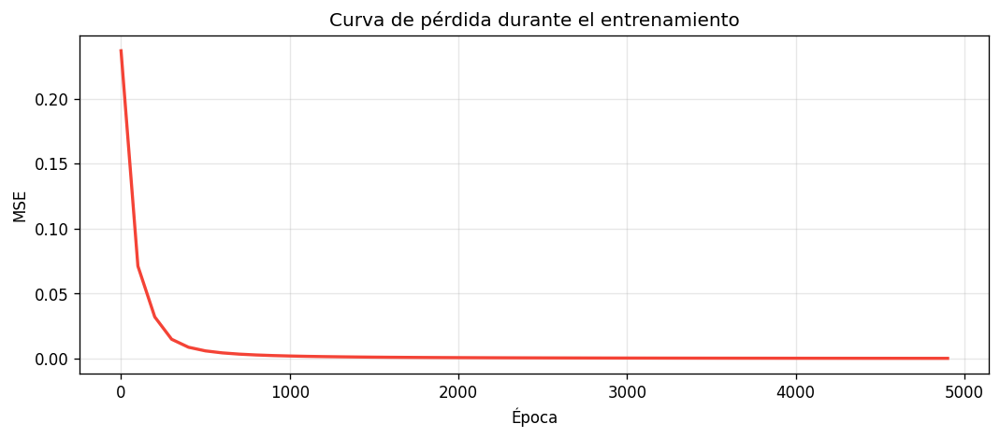 | Curva de pérdida durante el entrenamiento |
| 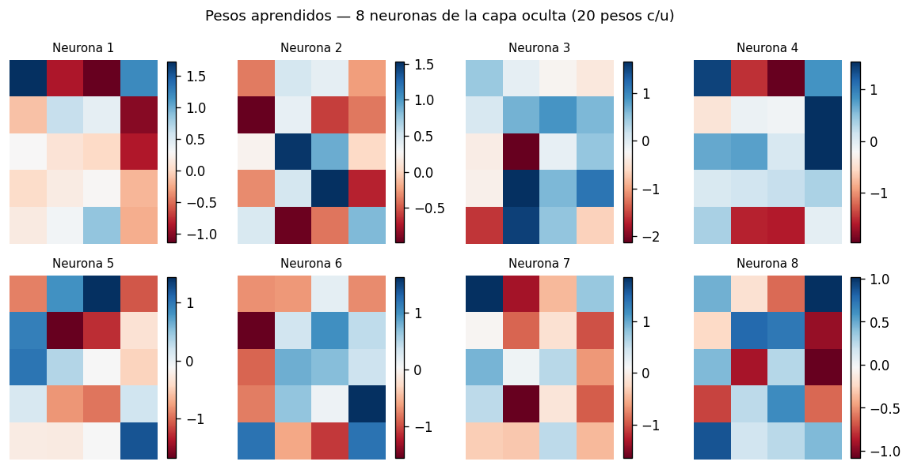 | Visualización de pesos de la capa oculta |
| 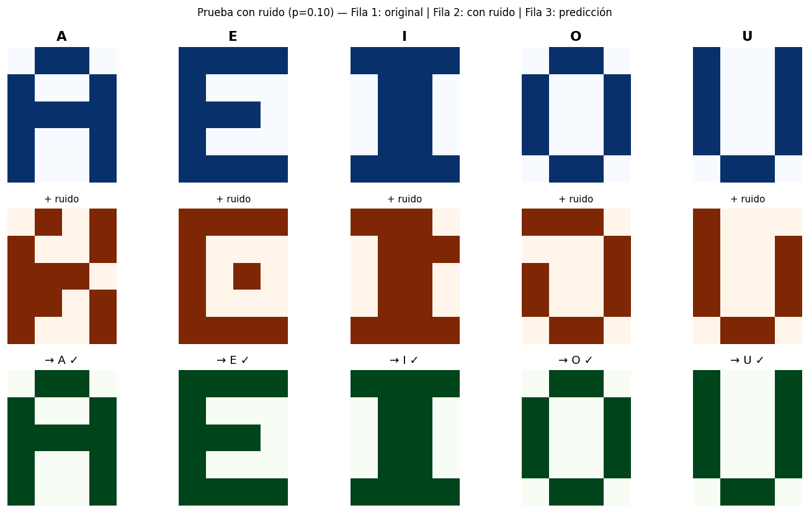 | Prueba de robustez con vocales ruidosas |

---

### 📊 Taller 06 — ML Clásico

Implementación **desde cero en NumPy** de cuatro algoritmos de clasificación supervisada, comparados sobre el dataset Iris (150 muestras · 4 características · 3 clases).

| Algoritmo | Principio | Accuracy |
|-----------|-----------|----------|
| **KNN (k=5)** | K vecinos más cercanos (distancia euclidiana) | 93.3% |
| **SVM lineal** | Perceptrón one-vs-rest con hinge loss + SGD | 68.9% |
| **Árbol de decisión** | CART con criterio Gini (depth=4) | 93.3% |
| **Bayes ingenuo** | Gaussiano con independencia de características | 91.1% |

| Imagen | Descripción |
|--------|-------------|
| 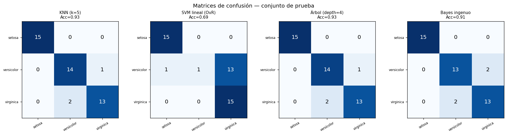 | Matrices de confusión de los 4 modelos |
| 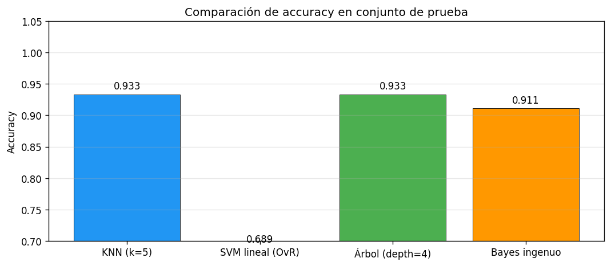 | Comparación de accuracy |

---

### 🔍 Taller 07 — Sistema RAG Académico

Pipeline completo de **Recuperación Aumentada por Generación (RAG)** para consultar información de la Universidad Nacional de Colombia.

```
Documentos / Web
      │
      ▼
Carga & Limpieza  ──►  Chunking Semántico (400 tokens, overlap 80)
                               │
                               ▼
                      Embeddings (SBERT multilingüe)
                               │
                               ▼
                      FAISS Vector Store
                               │
Pregunta usuario               │
      │                        │
      ▼                        │
Query Embedding  ──►  Retrieval Top-K + Reranking (cross-encoder)
                               │
                               ▼
                      Prompt Engineering
                               │
                               ▼
                      LLM (Ollama / OpenAI GPT-4o-mini)
                               │
                               ▼
                      Respuesta + Fuentes
```

| Módulo | Tecnología |
|--------|------------|
| Embeddings | `paraphrase-multilingual-MiniLM-L12-v2` |
| Vector Store | FAISS (IndexFlatIP — similitud coseno) |
| Reranking | `cross-encoder/ms-marco-MiniLM-L-6-v2` |
| LLM | Ollama (local) / OpenAI GPT-4o-mini |
| Web Scraping | requests + BeautifulSoup4 |
| PDF | PyMuPDF (fitz) |

| Imagen | Descripción |
|--------|-------------|
| 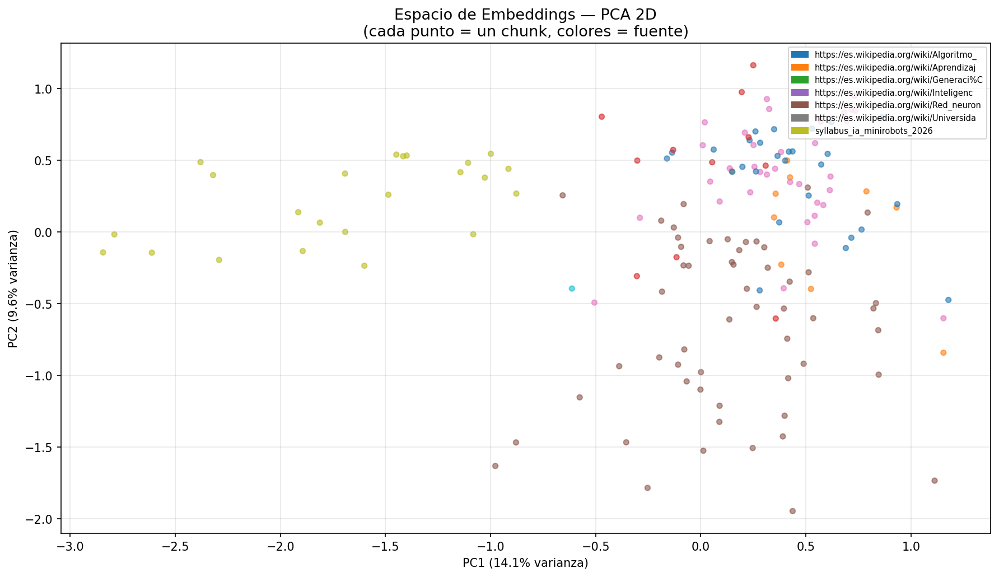 | Espacio de embeddings (proyección 2D) |
| 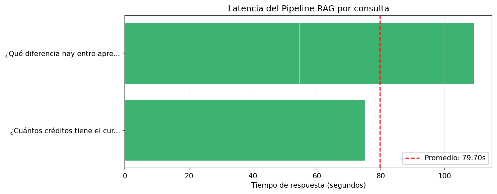 | Latencia por etapa del pipeline |
| 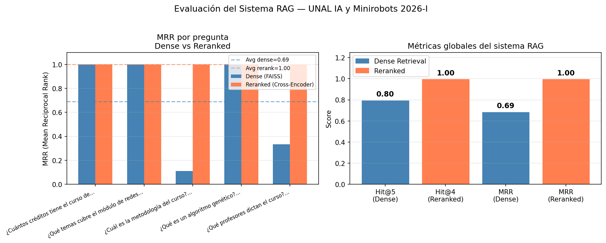 | Métricas de recuperación |

---

## ⚙️ Requisitos

```bash
# Entorno base (talleres 01–06)
pip install numpy matplotlib pandas jupyter

# Taller 07 — RAG
pip install sentence-transformers faiss-cpu openai requests \
            beautifulsoup4 pymupdf tiktoken tqdm python-dotenv
```

Para el Taller 07 con LLM local, instala [Ollama](https://ollama.com/) y descarga el modelo:

```bash
ollama pull llama3.2
```

---

## 🚀 Cómo ejecutar

```bash
# Clonar el repositorio
git clone <url-del-repo>
cd iayminirobots

# Abrir cualquier taller
jupyter notebook taller_01_definiciones_ia/taller_01.ipynb
```

Cada notebook es **autocontenido**: instala sus dependencias en la primera celda y puede ejecutarse de principio a fin con `Kernel → Restart & Run All`.

---

## 📄 Licencia

Material académico — Universidad Nacional de Colombia · 2026
